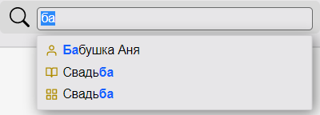

### Добавить информацию о человеке, его контакты, связь с вами

Удобно, когда ключевая информация о персоне хранится под рукой и доступна вместе с фотографиями человека.
 Tonfotos позволяет указать родственные и иные связи с другими персонами, добавить номер телефона, адрес электронной почты и другую информацию.

Добавить информацию о человеке можно только для тех персон, которые уже добавлены в библиотеку лиц. Как добавить персону, см. в статье [Добавить человека в библиотеку](add_person.md).

**Быстрые ссылки на сценарии:**
 [Добавить, просмотреть или отредактировать информацию о персоне](#add_person)
 [Добавить вручную персону в раздел **Близкие**](#close_people)
 [Добавить новую персону в уже существующую категорию](#add_new)
 [Скопировать данные из раздела информации данных](#copy_data)
 [Отредактировать данные](#edit_data)
 [Удалить данные](#del_data)
 [Удалить персону из категории **Близкие**](#del_person)
 [Удалить категорию](#del_cat)
 [Где хранится добавленная информация о человеке](#info)

Чтобы добавить, просмотреть или отредактировать информацию о персоне:
1. Перейдите на закладку с данными о персоне любым из описанных ниже способов:
   - на любой вкладке Tonfotos на клавиатуре одновременно нажмите клавиши **Ctrl + F**:
     - начните вводить имя персоны из библиотеки лиц, по мере ввода имени Tonfotos под строкой ввода имени будет показывать  с таким сочетанием букв; 
     - кликните мышкой по нужному варианту имени из списка, откроется закладка с данными о персоне;  
   - на любой вкладке Tonfotos (кроме вкладки **Места**) нажмите на иконку :
     - начните вводить имя персоны из библиотеки лиц, по мере ввода имени Tonfotos под строкой ввода имени будет показывать  с таким сочетанием букв; 
     - кликните мышкой по нужному варианту имени из списка, откроется закладка с данными о персоне; 
   - откройте вкладку **Люди**. Слева в окне в списке персон найдите нужного человека и кликните мышкой по его имени, откроется закладка с данными о персоне.
2. На закладке с именем персоны справа от имени кликните мышкой по иконке . Ниже откроется скрытая часть закладки **Подробная информация**.
3. Наиболее часто используемые данные можно ввести с помощью локального меню. 
 Чтобы открыть локальное меню в окне информации о персоне, наведите курсор мышки на заголовок **Подробные данные** или **Близкие**. Справа от заголовка появится иконка . Кликните по ней мышкой, откроется локальное меню для выбранной информации.
   - с помощью локального меню **Подробные данные** вы можете добавить:
      - даты рождения и смерти (или только год рождения или смерти);
      - номер телефона (домашнего или рабочего) и номер мобильного;
      - адрес человека;
      - адрес электронной почты (E-mail);
      - адрес веб-страницы;
      - прозвище;
      - фамилию, имя и отчество (ФИО);
      - фамилию в девичестве;
      - другие фамилии;
      - образование;
      - сословие;
      - профессию;
      - комментарий в свободной текстовой форме длиной до 1500 символов с пробелами.
   - с помощью локального меню **Близкие** выберите из предложенных вариантов кем вам приходится человек. Если ни один из вариантов не подошел, выберите вариант **Иное** или не выбирайте ни один из вариантов. 
    Под заголовком **Близкие** будут отображены все родственные и иные связи данной персоны. Все они будут сгруппированы по категориям отношения к данной персоне. Например, родители, родственники, сослуживцы и так далее. 
   Чтобы такая информация появилась в окне информации о персоне, её можно добавить вручную. Либо заполнить информацию о других персонах в окнах этих персон - для всех связанных друг с другом персон родственные и иные связи обновятся и отобразятся автоматически.
   
Чтобы добавить вручную персону в раздел **Близкие**: 
1. Наведите курсор мышки на заголовок **Близкие**. Справа от заголовка появится иконка . 
2. Кликните по ней мышкой, откроется локальное меню. 
3. Выберите из предложенных в меню вариантов категорию, кем для данной персоны является тот, кого вы хотите добавить.
4. Выберите из появившегося меню со списком имен нужное имя. Аватарка добавленной персоны появится в разделе **Близкие** под заголовком группы с названием категории отношения к данной персоне.

Чтобы добавить новую персону в уже существующую категорию:
1. Наведите курсор мышки на нужную категорию.
2. Справа от заголовка или аватарками персон этой категории появится иконка .
3. Кликните по ней мышкой, откроется локальное меню со списком имен. 
4. Выберите из появившегося меню нужное имя. Аватарка добавленной персоны появится в разделе **Близкие** под заголовком группы с названием категории отношения к данной персоне.

Введенные данные можно копировать, редактировать и удалять.

Копирование данных
 Скопировать можно все текстовые поля, за исключением полных дат, когда указан день, месяц и год.

Чтобы скопировать данные:
1. Наведите курсор мышки на строку с данными, которые вы хотите скопировать.
2. Справа от текста с данными появится иконка .
3. Кликните по ней мышкой.
4. Строка с данными автоматически выделится.
5. На клавиатуре нажмите **Ctrl + C**, данные скопируются в буфер обмена.

Чтобы отредактировать данные:
1. Наведите курсор мышки на строку с данными, которые вы хотите отредактировать.
2. Справа от текста с данными появится иконка .
3. Кликните по ней мышкой.
4. Строка с данными автоматически выделится.
5. Отредактируйте данные и нажмите кнопку Enter для сохранения, либо кликните мышкой в любое место за пределами редактируемого поля. В окне информации о персоне отобразится отредактированный текст.
 **Замечание**:
 Имя персоны можно изменить по этому же алгоритму.

Чтобы удалить данные:
1. Наведите курсор мышки на строку с данными, которые вы хотите удалить.
2. Справа от текста с данными появится иконка .
3. Кликните по ней мышкой.
4. Строка с данными автоматически выделится.
5. Удалите данные и нажмите кнопку Enter для сохранения, либо кликните мышкой в любое место за пределами редактируемого поля. В окне информации о персоне строка с удаленной информацией исчезнет.

Чтобы удалить персону из категории **Близкие**:
1. Наведите курсор мышки на аватарку персоны, связь с которой вы хотите удалить.
2. Кликните по ней правой кнопкой мышки.
3. Появится локальное меню **Убрать из ***название категории*** ** 
4. Кликните левой кнопкой мышки по этому пункту меню. Аватарка персоны исчезнет из категории и данная связь для этой персоны удалится.

Чтобы удалить ошибочно добавленную категорию:
1. Сверните окно информации о персоне: кликните мышкой по иконке .
2. Вновь развернитеокно информации о персоне: кликните мышкой по иконке .

Где хранится добавленная информация о человеке
 Информация о персонах хранится в служебных файлах Tonfotos. Эти файлы лежат в папках архива рядом с фотографиями. Не удаляйте эти файлы, чтобы не потерять информацию об отмеченных на фотографиях персонах, добавленную информацию о персонах и родственные связи.
 