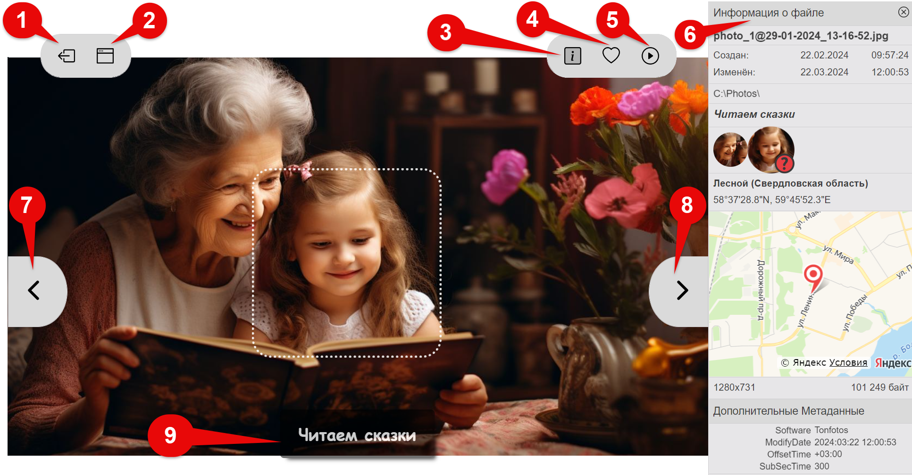

## Удалить дубликаты фото

Копии одного и того же файла могут быть разложены по разным папкам архива. Это могут быть как временные или случайно сделанные копии, так и специально продублированные файлы для тематического альбома или для удобства поиска. Эти копии занимают место на диске и не всегда нужны. Tonfotos позволяет быстро найти любой альбом, событие или персону на фото, если эта персона есть в библиотеке лиц Tonfotos. Поэтому архив можно упорядочить в том числе с помощью удаления дубликатов фотографий и видео и освободить место в хранилище.

**Дубликатами** в Tonfotos считаются файлы, на 100% совпадающие друг с другом по двум параметрам одновременно:
- для фотографий проверяется длина и контрольная сумма всего содержимого файла;
- для видео проверяется длина и контрольная сумма нескольких килобайт из середины файла.

Совпадение показателей двух параметров в разных файлах позволяет однозначно идентифицировать файлы как дубликаты. Имена файлов при этом могут быть разными, поскольку имена файлов не влияют на проверяемые параметры. 
 Tonfotos находит дубликаты файлов не только внутри одной папки, но и если файлы лежат в разных папках. 
 После первичной индексации папок архива Tonfotos отслеживает изменения в этих папках и при появлении новых дубликатов при импорте или иных действиях с архивом также покажет их.

**Замечание.**
 Если в файл добавить комментарий, заголовок или геометку, параметры файла изменятся и он перестанет автоматически определяться как дубликат. Поэтому рекомендуется начинать упорядочивание архива с удаления дубликатов. 

Вы можете удалить найденные дубликаты. Вы сами решаете, в каких папках оставить файлы, а в каких можно удалить дубликаты.

**Внимание!**
 Операция удаления дубликатов необратима. После удаления восстановить удаленные файлы будет невозможно. Рекомендуется сделать бекап всех папок архива до начала удаления дубликатов.
 Рекомендуется делать бекап архива регулярно и включать в бекап служебные файлы Tonfotos, которые находятся в папках архива. В этом случае вы всегда сможете восстановить случайно удаленные файлы и не потерять информацию об уже отмеченных на фото персонах. 

### Как узнать, что найдены дубликаты и как их удалить 

В Tonfotos есть два основных сценария удаления дубликатов: 
1. Удалить все файлы дубликатов разом, оставив по одной копии файлов. 
 Это быстро и удобно, снижает риск случайного удаления чего-то не того.
2. Удалить дубликаты в ручном режиме с предпросмотром каждого файла. Вы сами решите для каждого файла в какой из папок оставить единственный экземпляр фотографии или видео.

#### Удаление всех дубликатор разом  

Чтобы удалить дубликаты в автоматическом режиме, оставив по одному экземпляру фотографий или видео:
- откройте меню **Файл** -> **Удалить дубликаты...**. Откроется окно **Удаление дубликатов** (см. картинку ниже);
 
- изучите информацию о дубликатах:
  - в каких папках (см. отметку 1 на картинке) найдены дубликаты; 
  - идентичны ли они файлам этой же папки, или какой-то другой (в таблице указано файлам какой из папок они идентичны, см. отметку 2  на картинке);
  - сколько всего файлов дубликатов (см. отметку 3 на картинке);
  - общий размер всех файлов дубликатов в текущей папке (см. отметку 4 на картинке);
  - есть ли возможность удалить все (см. отметку 5 на картинке);
  - кнопка для перехода в альбом с найденными дубликатами (см. отметку 6 на картинке).
- нажмите кнопку **Удалить все**, чтобы удалить все дубликаты в одной выбранной папке или кнопку **В альбом**, чтобы посмотреть файлы до удаления. При необходимости дождитесь окончания процесса удаления и изучите таблицу заново - все показатели будут пересчитаны с учетом удаленных файлов, так как для каждой папки статистика по дубликатам считается отдельно;
- аналогичным образом удалите дубликаты во остальных папках, показанных в окне **Удаление дубликатов**.

#### Ручной режим с предпросмотром. Вкладка **Альбомы**
Фотографии и видео, для которых в процессе индексации были найдены дубликаты, можно просмотреть на вкладке **Альбомы** в альбоме **Дубликаты** (см. отметку 1 на картинке ниже).
 
Чтобы увидеть в каких папках лежат дубликаты фотографии или видео:
- кликните мышкой по миниатюре фотографии или видео в альбоме **Дубликаты**;
- откройте панель информации о файле. Для этого кликните мышкой по иконке , справа откроется панель **Информация о файле**;
- см. отметку 2 на картинке выше, это пример того, как выглядит перечень путей к файлам дубликатов для фотографии или видео.

Пути к файлам на панели информации частично свернуты, чтобы показать на узкой панели начальную часть пути и последние несколько символов имени файла с его расширением.
 Чтобы посмотреть полный путь к файлу, увидеть и удалить дубликат в папке архива на вкладке **Папки** :
- наведите курсор мыши на строку с путем к файлу, покажется подсказка с полностью видимым путем и именем файла;
  **Совет:**
 Наводя курсор мышки на каждую из строк путей, можно посмотреть в каких папках лежат все найденные дубликаты выбранного файла.
- кликните мышкой по строке с путем к дубликату. Окно переключится на вкладку **Папки** в ту папку, где хранится этот дубликат. Миниатюра изображения дубликата будет выделена синей рамкой;
- убедитесь, что в показанной папке найденный дубликат вам не нужен. Если в этой папке файл необходимо оставить, вернитесь на вкладку **Альбомы** в альбом **Дубликаты**, кликните по миниатюре нужного дубликата и повторите процедуру просмотра и удаления для дубликатов из других папок; 
  **Внимание!**
 Операция удаления файлов вручную необратима!
- чтобы удалить дубликат, убедитесь, что дубликат выделен синей рамкой и нажмите клавишу Del на клавиатуре. 
   Если в выбранной папке лежат только файлы дубликатов, можно удалить всю папку разом:
  - см. отметку 1 на картинке ниже. В центральной части окна на вкладке **Папки** под именем папки серым цветом показан подчеркнутый путь к папке. Кликните мышкой по этому пути, папка откроется в **Проводнике**;
  - чтобы удалить папку, убедитесь, что вы находитесь в нужной папке, выделите её мышкой и нажмите клавишу Del на клавиатуре. Папка будет удалена.
- перейдите снова на вкладку **Альбомы** в альбом **Дубликаты** и повторите процедуру для всех файлов дубликатов, которые вы хотите удалить вручную с предварительным просмотром.
 

