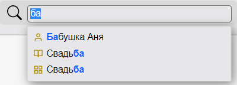

## Быстрый поиск по имени

Для упрощения поиска папкок, альбомов и персон из библиотеки лиц в Tonfotos есть возможность быстрого поиска по имени.

Чтобы открыть строку поиска, есть два варианта:
1. На любой вкладке Tonfotos на клавиатуре одновременно нажмите клавиши Ctrl + F:
     - начните вводить название папки, альбома или имя персоны из библиотеки лиц.
    По мере ввода текста Tonfotos под строкой ввода будет показывать список вариантов  названий и имен, в которых есть такое сочетание букв; 
     - кликните мышкой по нужному варианту имени или названия из списка.  
    **Замечание**.
    Обратите внимание, что иконки для папки, альбома и персоны отличаются. Это может служить подсказкой какую строку из списка выбрать.
     - В зависимости от выбранного из списка варианта откроется закладка с данными о персоне, альбом или папка.
2. На любой вкладке Tonfotos (кроме вкладки **Места**) нажмите на иконку :
     - начните вводить имя персоны из библиотеки лиц, по мере ввода имени Tonfotos под строкой ввода имени будет показывать  с таким сочетанием букв; 
     - кликните мышкой по нужному варианту имени из списка, откроется закладка с данными о персоне; 
