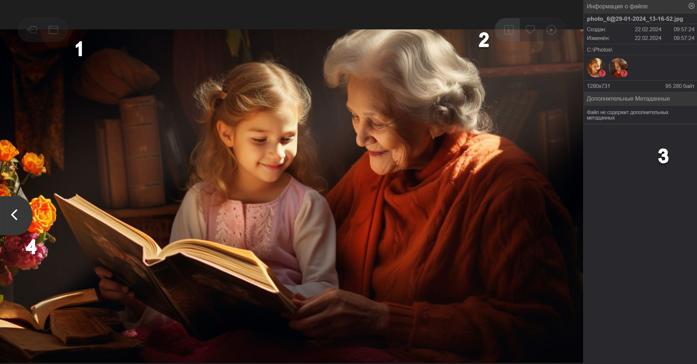

## Слайд-шоу

В режиме слайд-шоу показываются фото и видео для выбранной персоны, альбома, события или файлов одной папки.

 Для того, чтобы запустить слайд-шоу:
1. Найдите нужное событие, персону или альбом на соответствующих вкладках.
2. Кликните левой клавишей мыши по фото или видео файлу, с которого начнется показ слайд-шоу.
3. В верхнем правом углу главной панели Tonfotos кликните по иконке  для запуска слайд-шоу.

Управление режимом слайд-шоу:
 

| Цель                                   | Действие                                                                                                                                  | Номер подсказки на картинке |
|----------------------------------------|-------------------------------------------------------------------------------------------------------------------------------------------|-----------------------------|
| Выйти из режима слайд-шоу              | Нажать дважды кнопку Esc на клавиатуре                                                                                                    | -                           |
| Выйти из режима слайд-шоу              | Сместить курсор мыши в левый верхний угол экрана и кликнуть на иконку                                          | 1                           |
| Показать панель информации о файле     | Сместить курсор мыши в правый верхний угол экрана и кликнуть на иконку                           | 2, 3                        |
| Добавить показываемый файл в Избранное | Сместить курсор мыши в правый верхний угол экрана и кликнуть на иконку                                | 2                           |
| Остановить\запустить слайд-шоу         | Сместить курсор мыши в правый верхний угол экрана и кликнуть на иконку  или  | 2                           |
| Показать предыдущий слайд              | Сместить курсор мыши по центру слево до границы экрана и кликнуть на иконку                                | 4                           |
| Показать следующий слайд               | Сместить курсор мыши по центру вправо до границы экрана и кликнуть на иконку                               | аналогично 4, но справа     |

 Время показа слайда можно изменить, а анимацию и показ заголовков отключить. 
 Для этого:
1. В главном окне Tonfotos выберите пункт меню **Файл** > **Настройки...**
2. Измените время показа слайда или отключите опции в соответствующих полях.
3. Нажмите кнопку **Закрыть** для выхода из окна настроек.