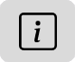

### Работа с геометками, места и события

**Что такое геометки, места, события**
Геометки, места и события это фильтры, которые:
- помогают быстро найти нужную подборку фотографий, например на карте мира или в виде альбома с названием события;
- отфильтровать и представить в виде отдельной подборки фотографий за определенный период;
- помогают сохранить более детальную информацию о фото в виде тэгов, сохраняемых внутри файла фотографии и доступных при работе в любом редакторе фото. 

**Как установить геометку для одной или нескольких фотографий**
 Геометку (место съемки) можно установить или отредактировать для одной или нескольких фотографий сразу.
1. На любой вкладке, кроме вкладки **Места** с картой мира, выберите одно или несколько фото, для которых хотите установить или изменить геометку.
 **Совет.**
 - Чтобы выбрать несколько снимков подряд, нажмите и удерживайте нажатой на клавиатуре кнопку Shift и кликните левой кнопкой мыши по первому и по последнему из следующих друг за другом снимков.
- Чтобы выбрать несколько снимков, но не подряд, нажмите и удерживайте нажатой на клавиатуре кнопку Ctrl и кликните левой кнопкой мыши по каждому из снимков.
2. В меню **Фото -> Редактировать место съемки...** введите координаты места в виде долготы и широты или установите флажок события на карте в визуальном режиме. Карту можно приближать и отдалять с помощью кнопок + и -. Для перемещения флажка кликните по нему левой кнопкой мыши, и не отпуская левую клавишу перетяните флажок на нужное место на карте. Для сохранения изменений нажмите кнопку **Сохранить**.  

**Как изменить дату съемки**
Отличия даты создания файла и даты съемки. Особенности простановки дат файла при сохранении файлов из Telegram или иных мессенджеров.

**Где в Tonfotos найти отсортированные по датам, местам, событиям фотографии**
 На вкладке **События** фотографии  отсортированы по дате. При клике мышкой по линейке времени на панели слева, в основной части окна вы увидите подробную информацию о фотографиях определенной даты.
 На вкладке **Места** на карте мира вы увидите для каждого места миниатюры с первой из подборки фотографий с геометкой этого места. Изменение миниатюры вручную пока недоступно.

**Где хранится информация о геометках, местах и событиях**
Такая информация хранится в тэгах файла фотографии. В Tonfotos вы можете посмотреть её на панели информации о файле. 
 Для этого кликните мышкой по иконке , справа откроется панель **Информация о файле**; 

 До начала работы по добавлению геометок или изменению дат съемки убедитесь, что:
- сделан бекап всех папок архива и в резервную копию скопированы также служебные файлы Tonfotos из всех папок архива. 
 Перемещение файлов и изменение геометок, комментариев, заголовков файлов и дат являются необратимыми действиями. Бекап поможет вам восстановить случайно измененные или перемещенные файлы архива;
- у вас есть права на запись для всех папок, содержимое которых вы планируете изменять.